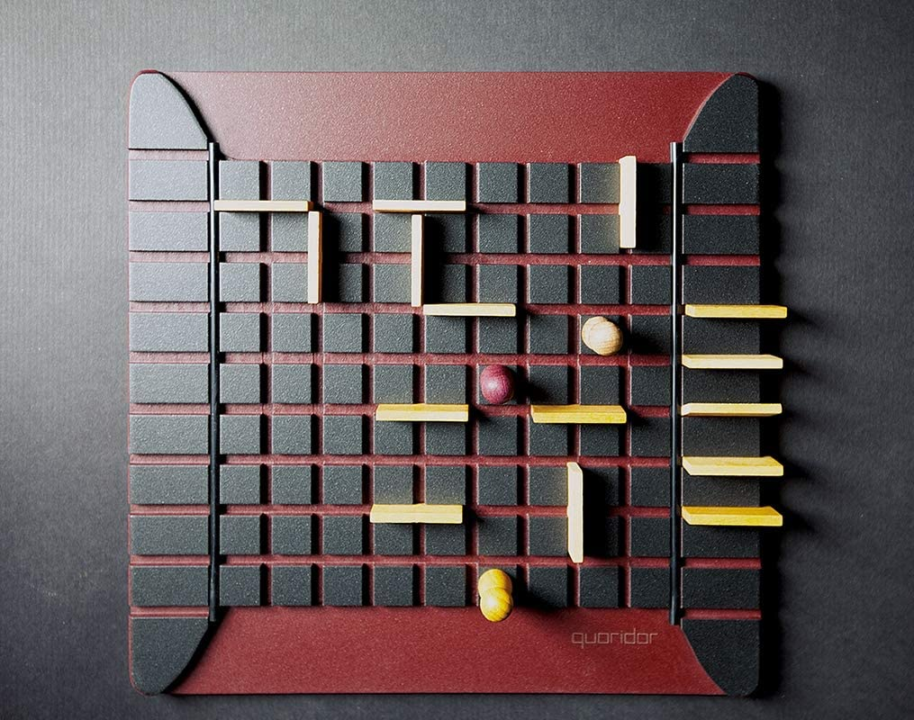
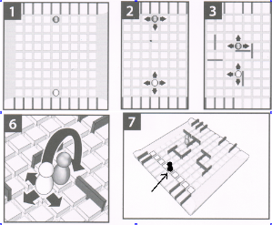

# ProjectName

A video game implementation of board game ***Quoridor***.

## Table of Contents

- [Game Rules](#game-rules)
- [Showcase](#showcase)
- [Requirements](#requirements)
- [Usage](#usage)
- [TODO](#todo)
- [License](#license)

## Game Rules

Quoridor is a 2 or 4-player turn-based strategy game. 

Each player is represented by a pawn which begins at the center space of one edge of the board (in a two-player game, the pawns begin opposite each other). The objective is to be the first player to move their pawn to any space on the opposite side of the game board from which it begins.

    

The distinguishing characteristic of Quoridor is its twenty walls. Walls are flat two-space-wide pieces which can be placed in the groove that runs between the spaces. Walls block the path of all pawns, which must go around them. The walls are divided equally among the players at the start of the game, and once placed, cannot be moved or removed. On a turn, a player may either move their pawn, or, if possible, place a wall.

    

More about game can be found on [Wiki](https://en.wikipedia.org/wiki/Quoridor).

## Showcase

[//]: # (place gif here with game core gameplay)

## Requirements

ProjectName requires the following to run:
- [C++][CppLink]
- [Make][MakeLink] (build automation tool)
- [SFML][SFMLLink] (free cross-platform multimedia library)

## Usage

Project Name is easiest to use with [Make][MakeLink].

`$ make`

`$ make run`

After that the game itself will appear ready to be played. Choose desired mode and start having fun.

To **move** player first click on a pawn and then choose available tile.
To  **place a wall** click on empty space, if all conditions are met the wall will appear.

## TODO

- Add AI
- Add online
- Add 4 players mod
- Change art style

## License

ProjectName is licensed under the [MIT][LicenseLink] license. 

[BoardPhoto]: ./media/showcase/BoardFromAbove.jpg
[RulesImage]: ./media/showcase/GameRules.png
[CppLink]: https://en.wikipedia.org/wiki/C%2B%2B
[MakeLink]: https://www.gnu.org/software/make/
[SFMLLink]: https://www.sfml-dev.org
[LicenseLink]: https://github.com/VladSach/ITG-Quoridor/blob/a2bb06c12ed59cc59ef8885dfb13b275e7bd8014/LICENSE
